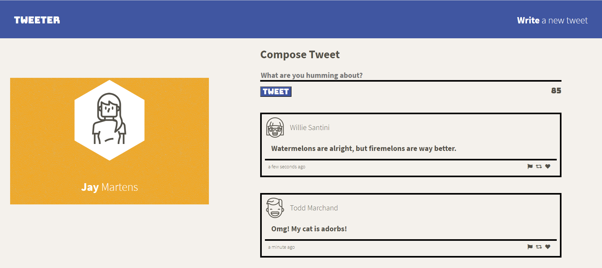
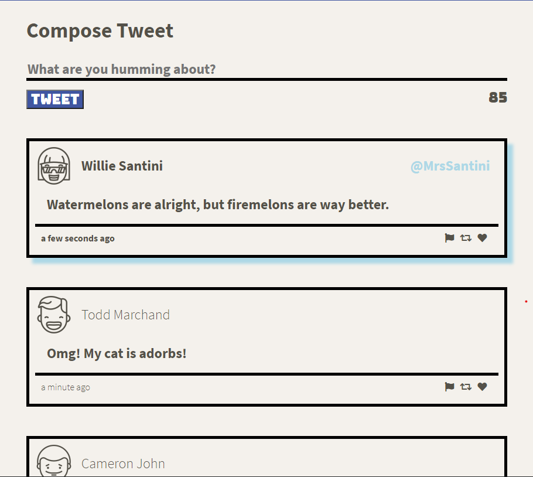

# Tweeter Project

Tweeter is a simple, single-page Twitter clone. The purpose of this app is to practice front-end development skills (CSS, flexboxes, responsive design).

## Final Product

## Dependencies

- Express
- Node 5.10.x or above

## Getting Started

- Install all dependencies (using the `npm install` command).
- Run the development web server using the `npm run local` command.